# Console Guessing Games

In this project you will explore writing console applications using C#.

- [Console Guessing Games](#console-guessing-games)
  - [Required Software:](#required-software)
    - [.NET](#net)
    - [C# Plugin for VS Code](#c-plugin-for-vs-code)
    - [XML Documentation Comments Plugin](#xml-documentation-comments-plugin)
    - [Spell Checker Plugin](#spell-checker-plugin)
  - [Setting up the Project](#setting-up-the-project)
    - [Sign up for the Project](#sign-up-for-the-project)
    - [Clone your repository](#clone-your-repository)
    - [Initialize the Project](#initialize-the-project)
  - [Before Starting](#before-starting)
  - [Milestone 1](#milestone-1)
    - [Task List](#task-list)
    - [Flowchart](#flowchart)
    - [Getting Started](#getting-started)
    - [Deliverable](#deliverable)
  - [Milestone 2](#milestone-2)
    - [Task List](#task-list-1)
    - [Getting Started](#getting-started-1)
    - [Deliverable](#deliverable-1)
  - [Milestone 3](#milestone-3)
    - [Task List](#task-list-2)
    - [Getting Started](#getting-started-2)
    - [Deliverable](#deliverable-2)
  - [Milestone 4: AP Written Response](#milestone-4-ap-written-response)
    - [Task List](#task-list-3)
    - [Deliverable](#deliverable-3)
  - [Grading](#grading)
    - [Computational Thinking](#computational-thinking)
    - [Computing, Programming, and Practice](#computing-programming-and-practice)
    - [Skills of a Programmer](#skills-of-a-programmer)
  - [Getting Help](#getting-help)
  - [Appendix A: Examples](#appendix-a-examples)
    - [User Input Example](#user-input-example)
    - [Random Number Generator Example](#random-number-generator-example)

## Required Software:

### .NET

.NET (pronounce dot net) is an open source developer platform, created by
Microsoft, for building many different types of applications. For this project,
you will be programming with a language called C# which is a simple, modern,
object-oriented, and type-safe programming language.

To use C#, you must first download the .NET platform for your operating system.

* Mac:
  [LINK](https://drive.google.com/file/d/1VL0sGmF5qYU8JvXGekFkGwVoTybK6qbE/view?usp=sharing)
* Windows:
  [LINK](https://drive.google.com/file/d/1uIuodO-uk_kHxBOUaIiP5_H0mIIZ-8Ch/view?usp=sharing)

### C# Plugin for VS Code

This plugin for VS Code provides syntax highlighting and debugging tools for you
to use while working on project written in C#.

Get it from the VS Code Market Place:
[LINK](https://marketplace.visualstudio.com/items?itemName=ms-dotnettools.csharp)

### XML Documentation Comments Plugin

C# utilizes a very specific documentation format that is used for generating
documentation. It is a bit tricky to enter manually. This plugin helps generate
comments in the proper format.

Get it from the VS Code Market Place:
[LINK](https://marketplace.visualstudio.com/items?itemName=k--kato.docomment)

### Spell Checker Plugin

This plugin will help with spell checking your source code and Markdown files:
[LINK](https://marketplace.visualstudio.com/items?itemName=streetsidesoftware.code-spell-checker)

## Setting up the Project

### Sign up for the Project

Sign-up for the project: [LINK](https://classroom.github.com/a/Kh9ebWxh)

### Clone your repository

After you have signed up for the project, you can clone it using GitHub Desktop.


1. Click the Current Repository drop down

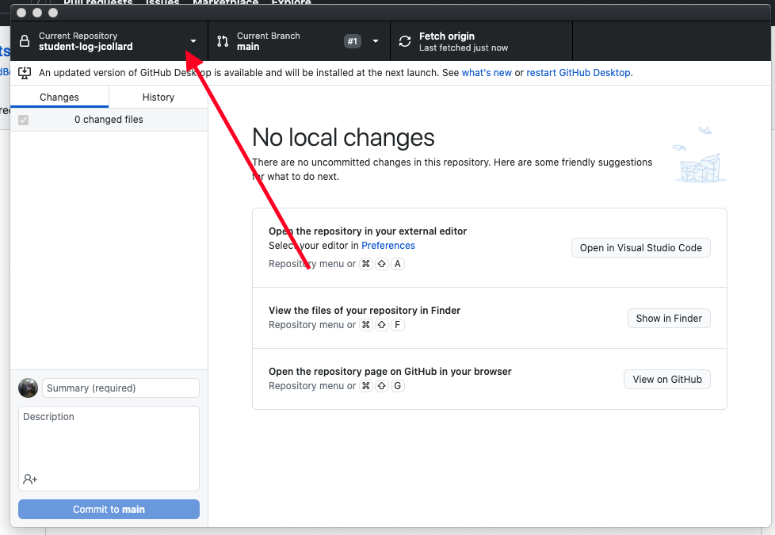

2. Click `Add` > `Clone Repository`

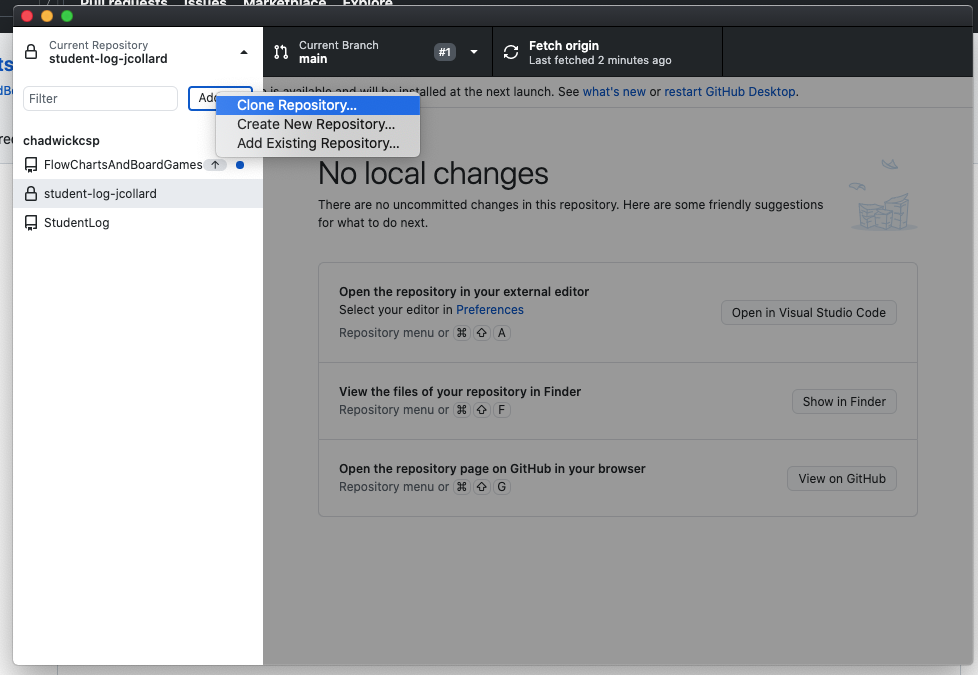

3. Select the `GitHub.com` tab

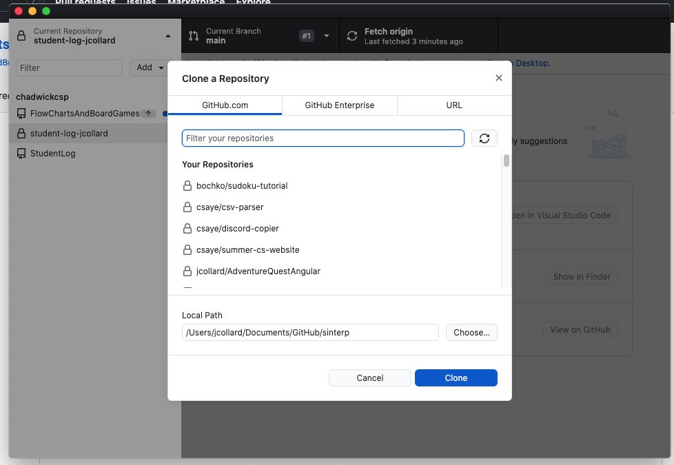

4. Select the `console-guessing-games-XXXXXX` repository and click clone. You
   may have to click the refresh icon next to `Filter your repositores` before
   it will be displayed.

5. Open the project in `Visual Studio Code`

### Initialize the Project

1. For the installed software to work, you must completely exit VS Code. From the top menu, select `Code` > `Quit Visual Studio Code`

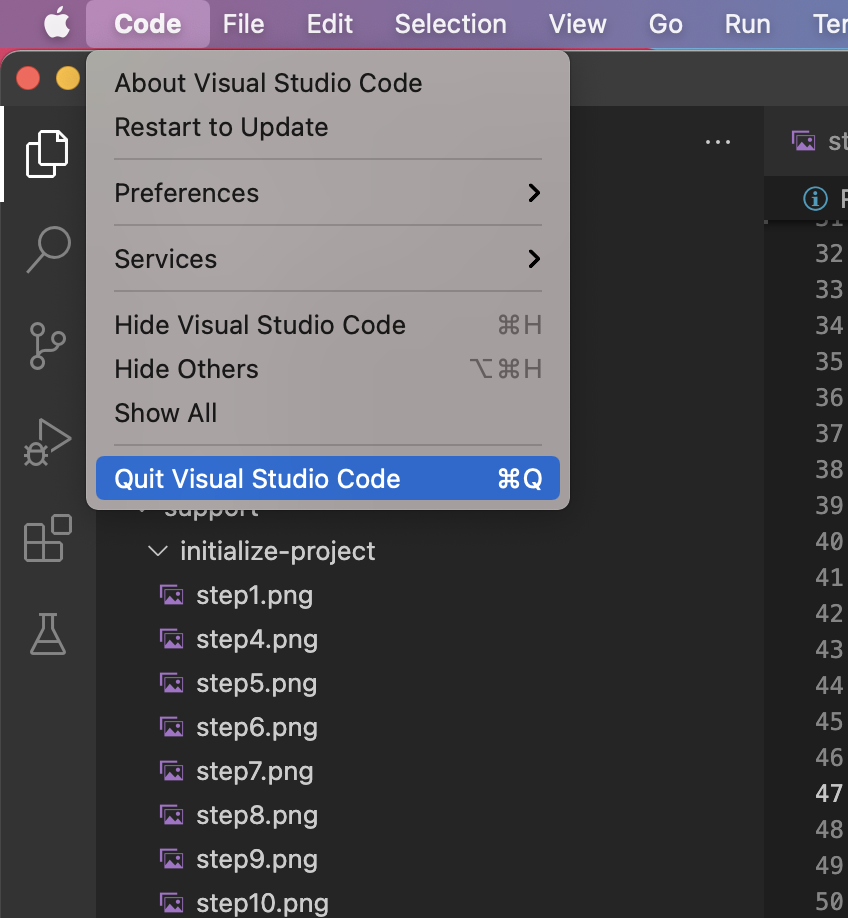

2. Open your project in VS Code.
3. Open the Command Palette (Command + Shift + P)
4. Search for: `Omnisharp` and select `Omnisharp: Select Project`.

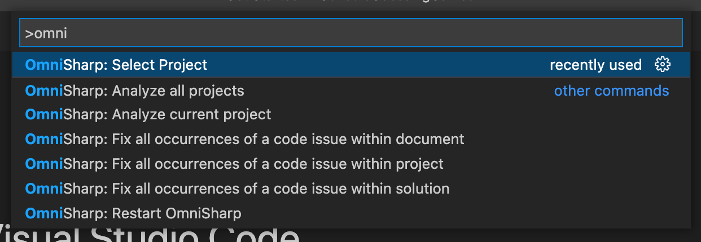

4. Select `ConsoleGuessingGames (All contained projects).

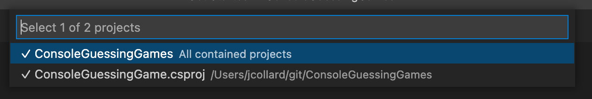

5. Open the Command Palette (Command + Shift + P)
6. Search for: `restore` and select `.NET: Restore All Projects`.

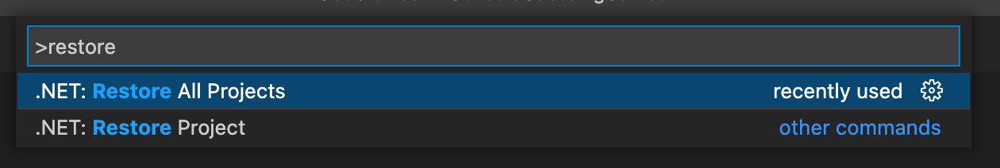

7. After a moment, you should see the following message in your `OUTPUT` tab:

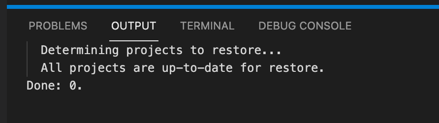

8. Open the Command Palette (Command + Shift + P)
9. Search for: `build` and select `Tasks: Run Build Task`

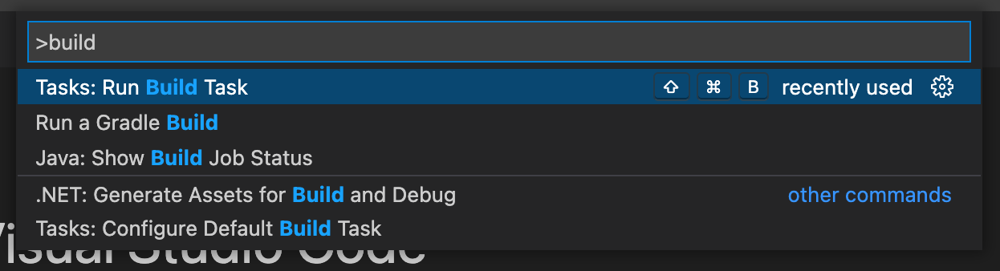

10. Select `build`

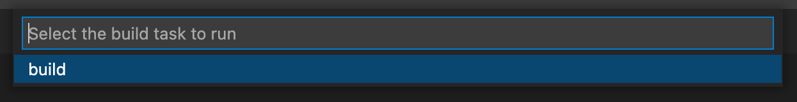

11. This compiles the sample project. After a moment you should see the following output in the `TERMINAL` tab:

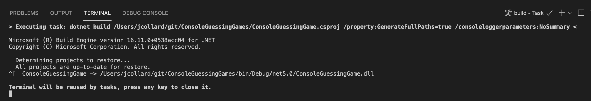

12. From the top menu, Select `Run` > `Run Without Debugging`

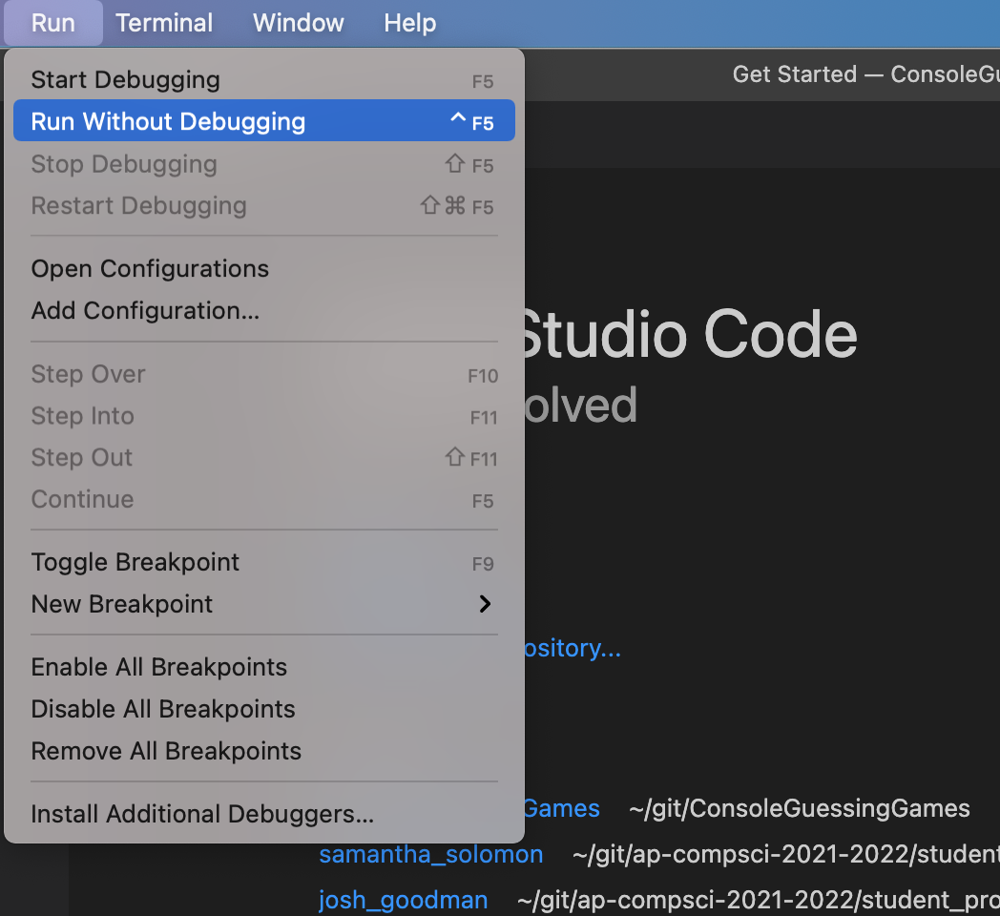

13. This will run the sample project. After a moment, you should see the following in the `DEBUG CONSOLE`

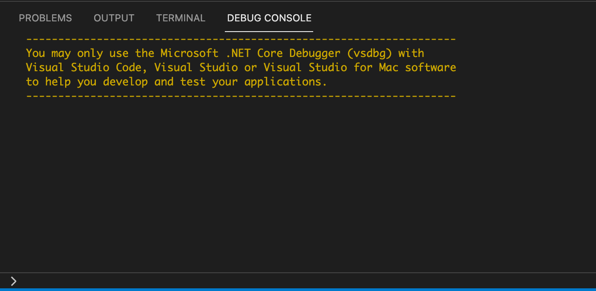

14. Click on the `TERMINAL` tab. You should see something similar to this:

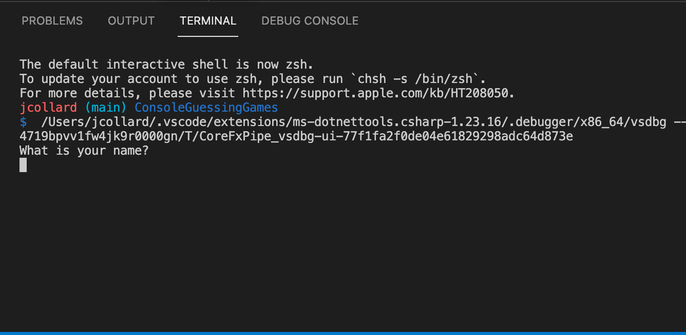

15. Type your name into the console and press enter. Then type your age into the console.

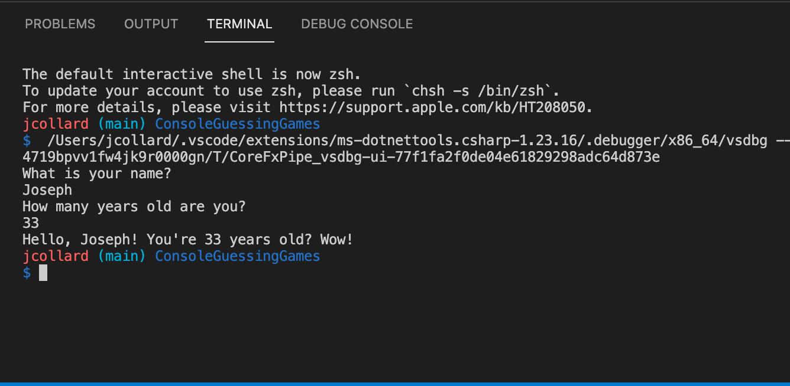

16. Congratulations! You're ready to program in C#


## Before Starting

**Note**: Before starting to program for this milestone, you should study the
[User Input Example](#user-input-example) and the [Random Number Generator
Example](#random-number-generator-example).

## Milestone 1

* **E Period** - Monday, October 25th @ 11:59 PM
* **C Period** - Sunday, October 24th @ 11:59 PM

### Task List

- [ ] Watch Example Videos
- [ ] Follow Tutorial Video to Get Started
- [ ] Complete the `SimpleGuessingGame.cs` file.
- [ ] Commit and push work regularly
- [ ] Tag `milestone-1`
- [ ] Push `milestone-1`

For this milestone, you must implement a simple number guessing game. At a high
level, the guessing game works in the following way:

1. The computer generates a random number between 0 and 100. It is possible that
   0 and 100 could be the random number.
2. The player guesses the number:
3. If the guess is below 0 or above 100, the player must make another guess.
   (Repeat Step 2)
4. If the guess is incorrect, the computer tells the player that they are too
   high or too low and they must guess again. (Repeat Step 2)
5. If the guess was correct, the game ends, the player wins, and a report is
   given to the player.

For example, the output of a game might look like this:

```
Number Guessing Game:
I'm thinking of a number between 0 and 100.
Enter a guess between 0 and 100.
50
Your guess is too high.
Enter a guess between 0 and 100.
25
Your guess is too high.
Enter a guess between 0 and 100.
12
Your guess is too low.
Enter a guess between 0 and 100.
18
Your guess is too low.
Enter a guess between 0 and 100.
22
You guessed my number!
You guessed incorrectly 4 times.
Guesses: 50 25 12 18 22
```

### Flowchart

Below is a flowchart that implements the entire Guessing Game.

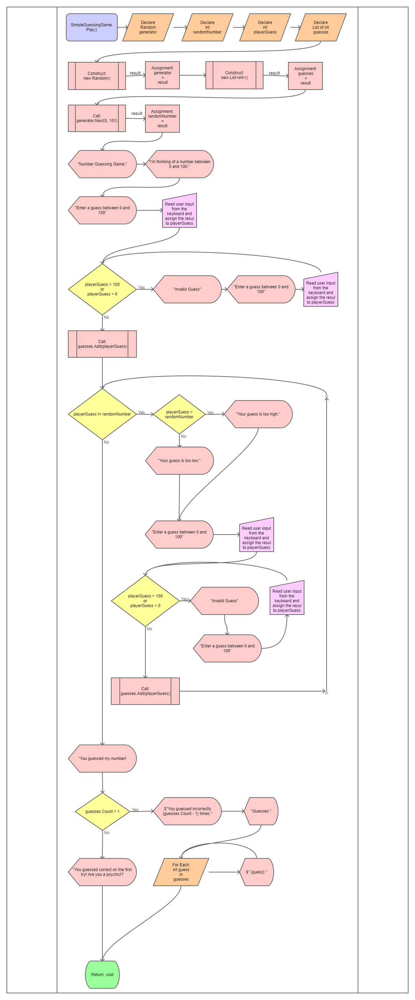

### Getting Started

There is a tutorial video to help you get started:
[LINK](https://drive.google.com/file/d/1AfU664VUtVyzeOVLO7GZh8CQDfZFMOwA/view?usp=sharing)

1. Start by creating a new folder inside of the `solution` directory.
2. Name this folder `SimpleGuessingGame`.
3. Create a new file called `SimpleGuessingGame.cs`.
4. Copy the template code below into the `SimpleGuessingGame.cs` file.

```csharp
namespace ConsoleGuessingGame
{
    using System;
    using System.Collections.Generic;

    /// <summary>
    /// This class contains a Simple Guessing Game.
    /// </summary>
    public class SimpleGuessingGame
    {
        /// <summary>
        /// Plays a Simple Guessing game where the player must guess a number between 0 and 100.
        /// </summary>
        public static void Play()
        {
          Console.WriteLine("I'm in the Play method!");
        }
    }
}

```

5. Update your `Program.cs` file to call the `SimpleGuessingGame.Play()` method.
6. Follow the flowchart and implement the Simple Number Guessing game.

### Deliverable

To submit Milestone 1, you should complete the Number Guessing Game as described
in the provided flowchart.

When you have completed your code, committed and pushed it, you will create a
tag called `milestone-1`. If you later decide you would like to change the
commit for `milestone-1` you may create additional tags with a version number.
For example, `milestone-1-v2` or `milestone-1-v3`. For final grading, the
`milestone-1` tag with the greatest version number will be used. After creating
your tag, don't forget to push it to GitHub and verify it is available online.


## Milestone 2

* **C Period** - Tuesday, October 26th @ 11:59 PM
* **E Period** - Wednesday, October 27th @ 11:59 PM

### Task List

- [ ] Follow Tutorial Video to Get Started
- [ ] Complete GetGuess flowchart
- [ ] Write GetGuess method
- [ ] Refactor Play method to use new GetGuess.
- [ ] Complete CheckGuess flowchart
- [ ] Write CheckGuess method
- [ ] Refactor Play method to use new CheckGuess method
- [ ] Complete DisplayReport flowchart
- [ ] Write DisplayReport method
- [ ] Refactor Play method to use new DisplayReport method
- [ ] Commit and push work regularly
- [ ] Tag `milestone-2`
- [ ] Push `milestone-2`

For this Milestone, you will refactor the Number Guessing Game you wrote in
Milestone 1 by breaking it down into the following methods:

```csharp
public static void Play(int minimum, int maximum);
public static int GetGuess(int min, int max);
public static string CheckGuess(int guess, int target);
public static void DisplayReport(List<int> guesses);
```

### Getting Started

There is a tutorial video to help you get started:
[LINK](https://drive.google.com/file/d/1lKFepyq2XXKaAYof5dvYk9ni9wJWrqYw/view?usp=sharing)

There is an incomplete pencil file in the `diagrams` directory of this project.
[diagrams/SimplifiedGuessingGame.epgz](diagrams/SimplifiedGuessingGame.epgz)

This file contains a complete `Play` method and incomplete flowcharts for the
`GetGuess`, `CheckGuess`, and `DisplayReport` methods.

1. Start by completing the `GetGuess` method flowchart.
2. Create a new folder called `SimplifiedGuessingGame` inside of the `solution`
   directory.
3. Create a new file called `SimplifiedGuessingGame.cs` inside of the new
   folder.
4. Copy the contents of your `SimpleGuessingGame.cs` file from Milestone 1 into
   the new file.
5. Update the class name to be `SimplifiedGuessingGame`
6. Refactor the `Play()` method to take 2 parameters, min and max: `Play(int
   minimum, int maximum)`
7. Add a comment for each variable
8. Create a new method for `GetGuess(int min, int max)`
9. Following your flowchart, complete the `GetGuess` method.
10. Test your GetGuess method in your `Program.cs` file by calling it directly.
11. Refactor the `Play` method to use `GetGuess`

Continue to refactor your `SimplifiedGuessingGame`. When you're finished, the
`Play` method should match the following flowchart:

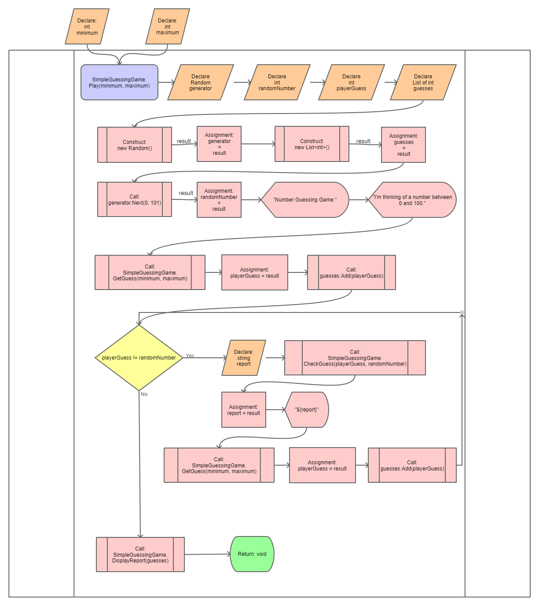

### Deliverable

To submit Milestone 2, you should complete the three incomplete flowcharts in
the provided pencil file. Additionally, you must create a new
`SimplifiedGuessingGame.cs` file that implements the flowcharts.

When you have completed your code, committed and pushed it, you will create a
tag called `milestone-2`. If you later decide you would like to change the
commit for `milestone-2` you may create additional tags with a version number.
For example, `milestone-2-v2` or `milestone-2-v3`. For final grading, the
`milestone-2` tag with the greatest version number will be used. After creating
your tag, don't forget to push it to GitHub and verify it is available online.

## Milestone 3

* **C Period** - Thursday, October 28th @ 11:59 PM
* **E Period** - Thursday, October 28th @ 11:59 PM

### Task List

- [ ] Follow Tutorial Video to Get Started
- [ ] Write GuessingGame constructor
- [ ] Refactor Play method
- [ ] Refactor GetGuess method
- [ ] Refactor CheckGuess method
- [ ] Refactor DisplayReport method
- [ ] Commit and push work regularly
- [ ] Tag `milestone-3`
- [ ] Push `milestone-3`

For this Milestone, you will refactor the Number Guessing Game you wrote in
Milestone 2 by turning it into an Object that uses member variables to store
it's data. When you are finished, you will have the following, non-static
methods:

```csharp
public void Play();
public int GetGuess();
public string CheckGuess(int guess);
public void DisplayReport();
```

### Getting Started

There is a tutorial video to help you get started:
[LINK](https://drive.google.com/file/d/1WEFVkOhP4_YqIt8p41Kaw3aoAHKqlt2t/view?usp=sharing)

1. Create a new folder called `GuessingGame` inside of the `solution` directory.
2. Create a new file called `GuessingGame.cs` inside of the new folder.
3. Copy the contents of `SimplifiedGuessingGame.cs` into the new file.
4. Update the class name to `GuessingGame`
5. Remove the `static` keyword from each method in `GuessingGame.cs`
6. Update each method call to use the `this` keyword.
7. Add two member variables to the `GuessingGame` class:
    * `private readonly int minimum`
    * `private readonly int maximum`
8. Create a constructor for `GuessingGame` which takes in two parameters:
    * `GuessingGame(int minimum, int maximum)` and initializes the member
      variables
    * `this.minimum = minimum`
    * `this.maximum = maximum`
9. Refactor the `GuessingGame` code to use the member variables.

To finish Milestone 3, you will need to add the following two member variables:

```csharp
private List<int> guesses;
private int randomNumber;
```

Notice that these two variables are do not have the `readonly` keyword. This is
because these variables need to be reinitialized each time the `Play()` method
is called. The `readonly` keyword ensures that the variable may only be assigned
to a single time.

### Deliverable

To submit Milestone 3, you should complete the object oriented version of the
number guessing game in your `GuessingGame.cs` file.

When you have completed your code, committed and pushed it, you will create a
tag called `milestone-3`. If you later decide you would like to change the
commit for `milestone-3` you may create additional tags with a version number.
For example, `milestone-3-v2` or `milestone-3-v3`. For final grading, the
`milestone-3` tag with the greatest version number will be used. After creating
your tag, don't forget to push it to GitHub and verify it is available online.

## Milestone 4: AP Written Response

* **C Period** - Sunday, October 31st @ 11:59 PM
* **E Period** - Sunday, October 31st @ 11:59 PM

### Task List

- [ ] Fix all previous milestones for final grading
- [ ] Complete Written Response README.md
- [ ] Commit and push work regularly
- [ ] Tag `milestone-4`
- [ ] Push `milestone-4`

In May, you will need to create and submit a project to the AP College Board as
well as a write up explaining how you meet the rubric.

For this Milestone, you will create a written response of the required format.

A template README.md file is available in the `WrittenResponse` directory of
this project. Complete each of the TODO sections.

### Deliverable

To submit Milestone 4, you should complete *ALL* TODOs from the
`WrittenResponse/README.md` file. You may may changes to any previous milestone
for full points in the Computational Thinking and Computing, Programming, and
Practice categories and resubmit with this milestone.

When you have completed your code, committed and pushed it, you will create a
tag called `milestone-3`. If you later decide you would like to change the
commit for `milestone-3` you may create additional tags with a version number.
For example, `milestone-3-v2` or `milestone-3-v3`. For final grading, the
`milestone-3` tag with the greatest version number will be used. After creating
your tag, don't forget to push it to GitHub and verify it is available online.


## Grading

For this project, you will receive two project grades. One for Milestones 1 and
2 and another for Milestones 3 and 4. You can think of this project as two
related projects.

### Computational Thinking

In this assignment, you will demonstrate your understanding of flow charts,
sequencing, selection, and iteration.

| Advanced                                                    | Proficient                                                            | Basic                                                            | Below Basic                                                             |
|-------------------------------------------------------------|-----------------------------------------------------------------------|------------------------------------------------------------------|-------------------------------------------------------------------------|
| Student successfully implements all 3 Number Guessing Games | Student successfully implements the simplified Number Guessing Game   | Student Successfully implements the Simple Number Guessing Game  | Student does not successfully implement the Simple Number Guessing Game |
|                                                             | Student attempts to complete the Object Oriented Number Guessing Game | Student attempts to complete the simplified Number Guessing Game |                                                                         |
|                                                             |                                                                       | Student completes all 3 flowcharts.                              |                                                                         |

### Computing, Programming, and Practice

It is important for other people to be able to understand and follow your work.
In this assignment, you will demonstrate your ability to commit your work to
your repository, write reasonable commit messages, and provide a REAME.md
document describing how your flow diagram relates to your chosen game's
instructions. 

| Advanced                                                                                          | Proficient                                                                                          | Basic                                                                          | Below Basic                                                                                                  |
|---------------------------------------------------------------------------------------------------|-----------------------------------------------------------------------------------------------------|--------------------------------------------------------------------------------|--------------------------------------------------------------------------------------------------------------|
| Student follows all flowchart rules from Appendix A.                                              | Student created a tag for all milestones                                                            | Student tagged some of their milestones                                        | Student did not tag any of their milestones                                                                  |
| Code blocks use syntax highlighting for the correct programming language                          | Student's README.md files contain all necessary headers, images, and code block                     | Student creates a README.md for their own adventure.                           | Student does not create a README.md for their own adventure or their README.md is not in the correct folder. |
| All member variables have a comment.                                                              | The majority of member variables have a comment one or two variables may be missing a comment.      | More than two member variables are missing a comment.                          | More than half the member variables are missing a comment.                                                   |
| All methods or functions have a comment                                                           | The majority of methods or functions have a comment one or two methods may be missing a comment.    | More than two methods or functions are  missing a comment.                     | More than half the methods or functions are missing a comment.                                               |
| All code is formatted consistently.  Hint: Use (Command + Shift + P) and  select Format Document. | The majority of the code is formatted consistently. A one or two files may be missing formatting.   | More than two files are not formatted.                                         | More than half the files are not formatted.                                                                  |
| All variables, methods, and functions have type  annotations.                                     | The majority of variables, methods, and functions have type annotations. One or two may be missing. | More than two variables, methods, or functions have a type annotation missing. | More than half the variables, methods, or functions are missing a type annotation.                           |
| No variables, methods, or functions use the `any` type.                                           | One or two variables, methods, or functions use the `any` type.                                     | More than two variables, methods, or functions use the `any` type.             | More than half the variables, methods, or functions use the `any` type.                                      |

### Skills of a Programmer

Your skills of a programmer covers your Student Log repository, your in class
time management, meeting deadlines, asking for help when needed, and helping
others when able.


| Advanced                                                                                                                  | Proficient                                                                                                                                                | Basic                                                                                                                                   | Below Basic                                                                                         |
|---------------------------------------------------------------------------------------------------------------------------|-----------------------------------------------------------------------------------------------------------------------------------------------------------|-----------------------------------------------------------------------------------------------------------------------------------------|-----------------------------------------------------------------------------------------------------|
| Manages time well in class,  stays focused on work at hand at almost all times                                            | Focuses on work in class                                                                                                                                  | Focuses at times, can get distracted                                                                                                    | Uses class time poorly, is frequently distracted                                                    |
| Meets all deadlines, ahead of schedule by at least 2 hours.                                                               | Meets deadlines or asks for an extension at least 48 hours ahead of time.                                                                                 | Delivers close to deadline, may be late  by a day or two                                                                                | Delivers work late or not at all                                                                    |
| Participated on Piazza by asking a question, answering a question, or creating a helpful note for other students.         | Seeks assistance when needed                                                                                                                              | Needs prompting to seek assistance                                                                                                      | Does not seek assistance or ask for help when needed                                                |
| Almost all log entries are pushed after creating them.                                                                    | Almost all log entries provide a consistent commit timestamp relative to the date mentioned in the entry. All log entries are pushed prior to milestones. | Log entries follow the proper  sign-on and sign-off format.                                                                             | Few or no log entries follow the proper sign-on and sign-off format.                                |
| Student creates a sign-on and sign-off log entry  every class and between each block period. Only missing 1 or 2 entries. | Student creates a sign-on and sign-off log entry  almost every class and between each block period. Only missing 1 or 2 entries.                          | Student creates a sign-on and sign-off log entry most classes and almost always between each block period. Only missing 3 or 4 entries. | Student frequently misses creating a sign-on and sign-off log entry. Missing 5 or more log entries. |


## Getting Help

All questions should be posted to the class Piazza Q&A. You are also encouraged
to help other students who post on Piazza. When you post your question, be sure
to include as many details as possible for reproducing the issue you're having.

Questions you should answer when asking a question include:

1. What are you trying to do?
2. What did you try?
3. What was the result?

Work hard to make sure the person trying to answer your question can reproduce
your error. Share your files so others can run exactly what you're running.

Also, include screenshot / pictures if applicable.

Formulating good questions is a good life long skill. You should try asking your
question on Piazza before seeking out synchronous time with Mx. Collard.
However, if you would like to meet to discuss synchronously, first, look at [Mx.
Collard's Calendar](http://tinyurl.com/collard-calendar), then send them an
email with at least two proposed times you would like to meet.

## Appendix A: Examples

### User Input Example

Video Walkthrough:
[LINK](https://drive.google.com/file/d/1ZAD3kipCVTLxBcb7BdZUY4325468vBer/view?usp=sharing)

This example shows how to print messages to the console as well as reading user
input from the console.

To run this example, update the `Program.cs` file to call the `UserInput.Run()`
method.

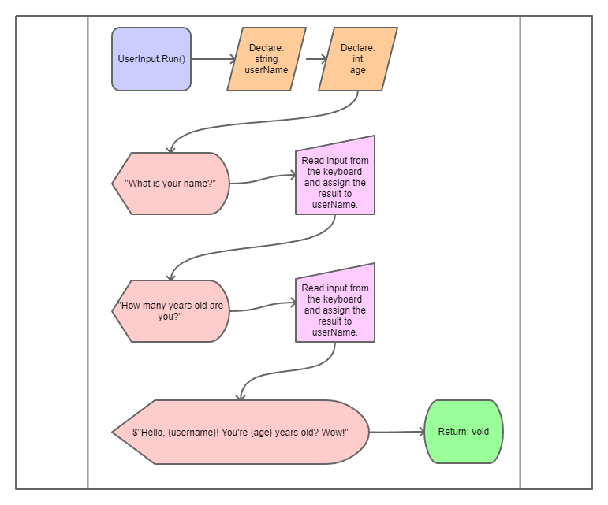

### Random Number Generator Example

Video Walkthrough:
[LINK](https://drive.google.com/file/d/1aPjyCk9F0VvQ8GtrD9qwiW70VJPP49ET/view?usp=sharing)

This example shows how to generate a list of random numbers and print them to
the console.

To run this example, update the `Program.cs` file to call the
`RandomNumerGenerator.Generate(0, 100, 10)` method. Notice that you can modify
the values that are passed to the method to change the outcome of the method.

